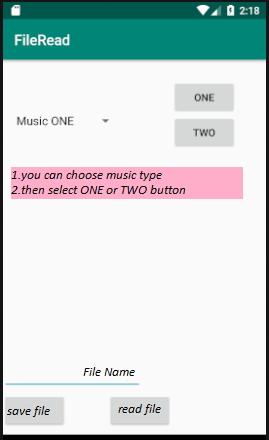
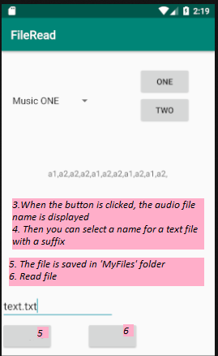

# AndroidProject-External-Storage
This is an android project written by Android studio for save text file in external storage and then read file.
you will need to install APK file on your Android device. 

